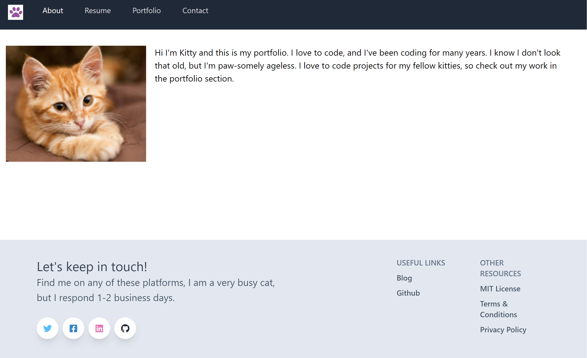
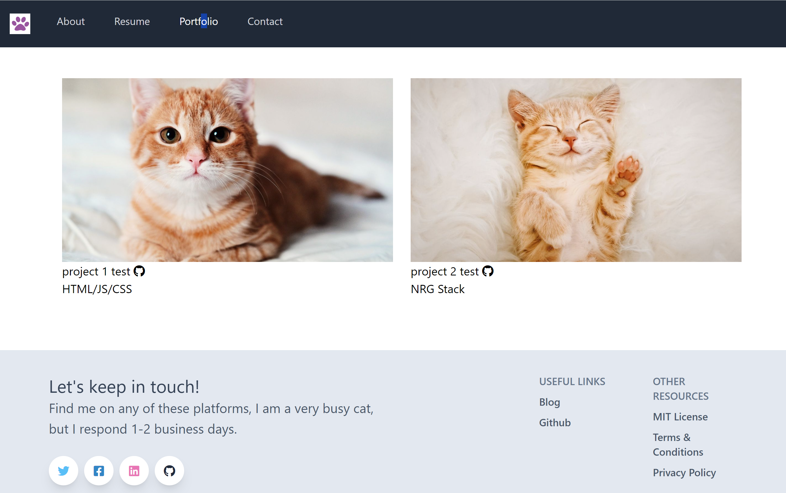
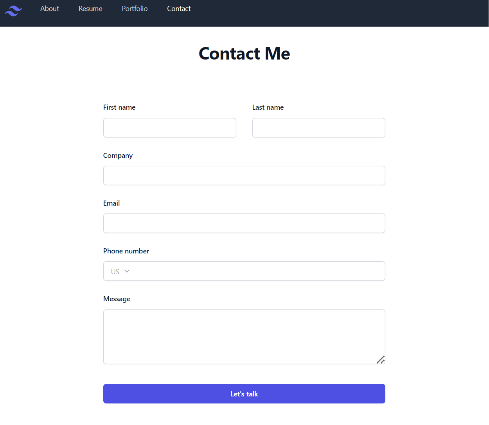

# React + Vite Updated Portfolio 
  
  
  ## Description  ✏️
  
  This repo shows updated code for using the Vite buiild tool instead of CRA. Now will tailwindcss
  
  ## Table of Contents 📖
  
  - [Installation](#installation-🛠️)
  
  - [Usage](#usage-👨‍💻)

  

  - [Issues](#known-issues-🤔)

  - [Contributing](#how-to-contribute-🤝)
  
  - [Tests](#tests-🧪) 

  - [Credits](#credits-🏆)
  
  - [Questions](#questions-❓)
  
  ## Installation 🛠️
  
  To install necessary dependencies, run the following command:
  
  ```
  npm i
  ```
  
  ## Usage 👨‍💻
  
  Clone the repository, install dependencies and run npm start dev

  ### Deployed Link
  not deployed at this time

### Screenshots





## Known Issues 🤔
Still coding it

## How To Contribute 🤝
  
Fork the repository and make a pull request with your new code.
  
## Tests 🧪
  
To run tests, run the following command:
  
  ```
  n/a
  ```


## Credits 🏆
tailwindcss

 ## Questions ❓
  
If you have any questions about the repo, open an issue or contact me directly at megan.meyers.388@gmail.com. 
  
  