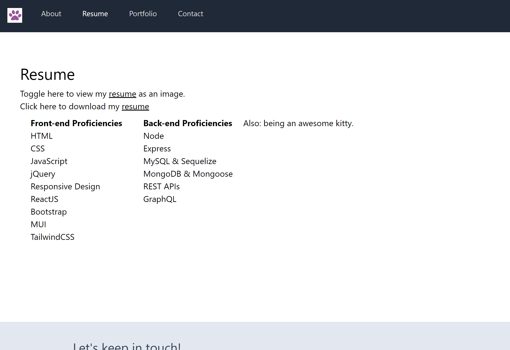
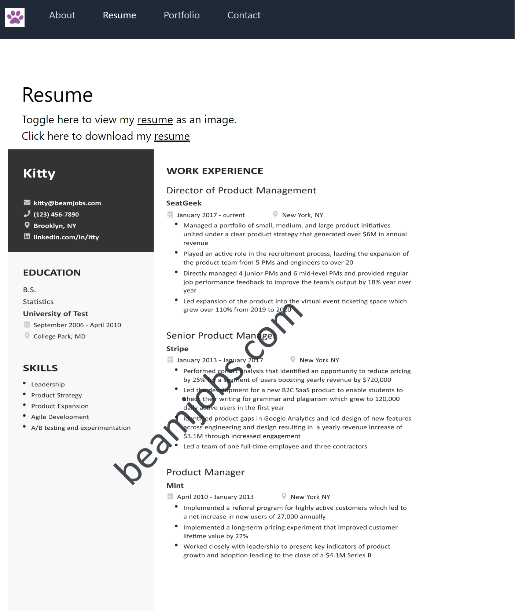

# Kitty's New Portfolio - React + Vite
  
  
  
  
  
  ## Description  ✏️
  
  This repo shows updated code for using the Vite buiild tool instead of CRA. Now with tailwindcss!
  
  ## Table of Contents 📖
  
  [Installation](#installation)
  
  [Usage](#usage)

  

  [Issues](#known-issues)

  [Contributing](#how-to-contribute)
  
  [Tests](#tests) 

  [Credits](#credits)
  
  [Questions](#questions)
  
  ## Installation
  
  To install necessary dependencies, run the following command:
  
  ```
  npm i
  ```
  
  ## Usage
  
  Clone the repository, install dependencies and run npm start dev

  Exciting update: This is now a full PWA app. It is installable, works offline, and is superfast after first load thanks to a robust precache strategey. Use Chrome dev tools to see all the details and test it youself. 

  ### Deployed Link
 [Click here to see kitty's portfolio on Netlify](https://sparkly-custard-dd3fea.netlify.app/)

### Screenshots





_____________________________________________


## Known Issues
- Support for multi-page view resume as image is not yet provided, but coming soon. 


## How To Contribute
  
Fork the repository and make a pull request with your new code.
  
## Tests
  
To run tests, run the following command:
  
  ```
  n/a
  ```


## Credits
Footer by: Creative Tim
@creative-tim
Fully Coded UI Tools to create web and mobile apps [creative-tim](http://www.creative-tim.com)

 ## Questions
  
If you have any questions about the repo, open an issue or contact me directly at megan.meyers.388@gmail.com. 
  
  